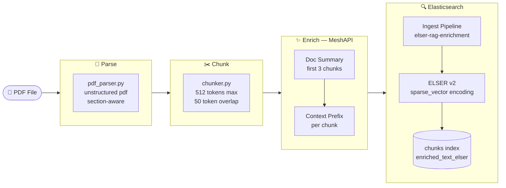
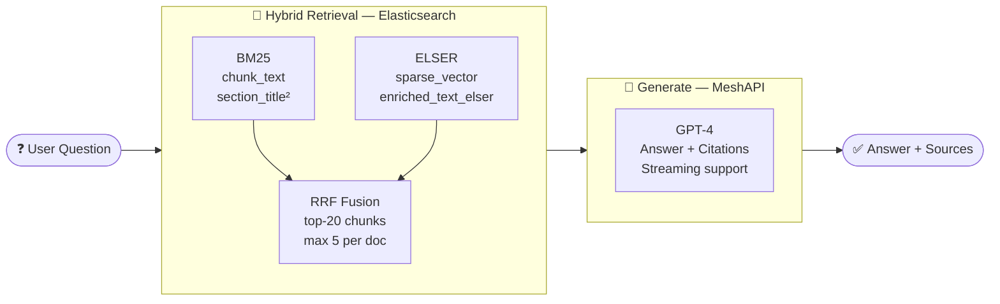
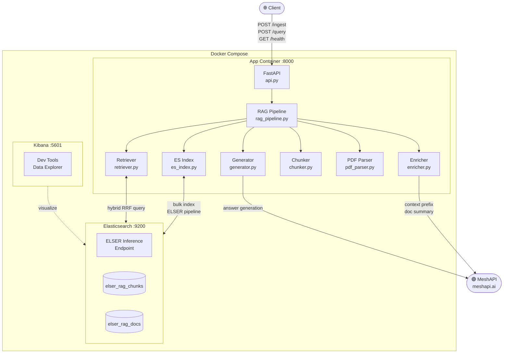
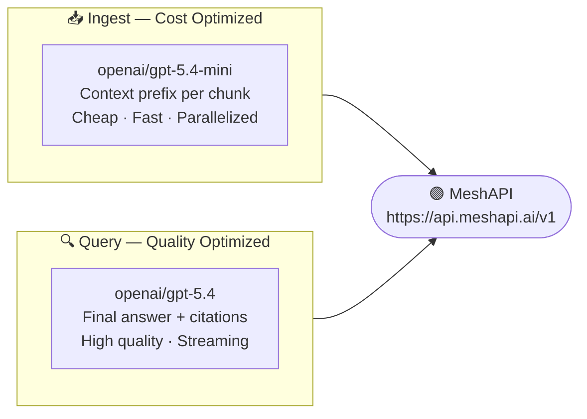
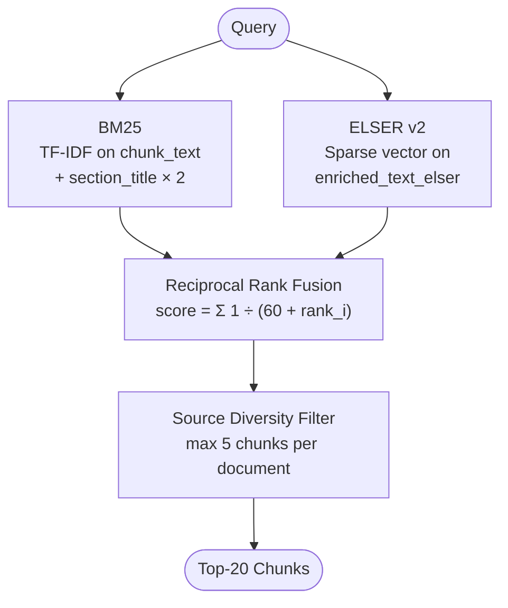
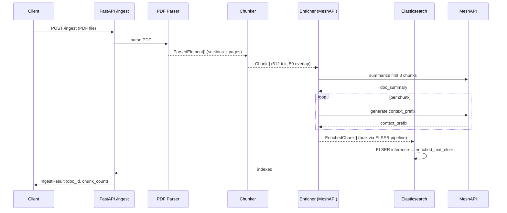

# ELSER-RAG

> **Production-grade RAG over PDF documents using Elasticsearch ELSER — no dedicated vector database, no dense embeddings.**

[](https://python.org)
[](https://elastic.co)
[](https://fastapi.tiangolo.com)
[](https://docker.com)
[](https://meshapi.ai)

ELSER-RAG turns any PDF into a queryable knowledge base using Elasticsearch's native sparse vector model (ELSER v2) for semantic retrieval, fused with BM25 via Reciprocal Rank Fusion. Powered by **[MeshAPI](https://meshapi.ai)** for LLM enrichment and generation — all without a separate vector store.

---

## Why ELSER-RAG?

Most RAG systems bolt a dedicated vector database (Pinecone, Qdrant, Weaviate) onto an existing search stack, doubling infrastructure and maintenance overhead. ELSER-RAG eliminates that — Elasticsearch handles **both** keyword and semantic search natively using its built-in ELSER model.

### Sparse vectors vs dense embeddings

This is the core technical distinction. Standard RAG uses **dense embedding models** (e.g. `text-embedding-ada-002`, `text-embedding-3-large`) that encode text as a fixed-length array of floats:

```
"The model shows strong performance" → [0.12, -0.34, 0.87, 0.03, -0.61, ...]  # 1536 floats
```

ELSER v2 produces **sparse token-weight vectors** instead — a dictionary of meaningful tokens mapped to importance scores:

```
"The model shows strong performance" → {"model": 0.92, "performance": 0.87, "strong": 0.74, "shows": 0.41, ...}
```

| Property | Dense Embeddings | ELSER Sparse Vectors |
|:---|:---:|:---:|
| Representation | `[0.12, -0.34, 0.87, ...]` | `{"model": 0.92, "perf": 0.87}` |
| Dimensions | Fixed (768–3072 floats) | Variable (only non-zero tokens) |
| Interpretability | Opaque — no human meaning | Transparent — token weights visible |
| Retrieval mechanism | ANN (cosine similarity) | Inverted index (fast, exact) |
| External model needed | Yes — embedding API call | No — ELSER runs inside ES |
| Storage | Dense float array | Compressed sparse map |

Because sparse vectors use the inverted index — the same structure BM25 uses — Elasticsearch retrieves them with the same speed and infrastructure as keyword search. No approximate nearest-neighbor index, no separate vector DB, no embedding API call at query time.

### Infrastructure comparison

| Capability | Traditional RAG | ELSER-RAG |
|:---|:---:|:---:|
| Semantic search | External vector DB | Elasticsearch ELSER ✓ |
| Keyword search | Separate BM25 index | Same ES index ✓ |
| Hybrid fusion | Custom re-ranking code | Native RRF in ES query DSL ✓ |
| Embedding at query time | External API call | Runs inside ES ✓ |
| Infrastructure | ES + Vector DB + LLM | **ES + LLM only** ✓ |
| Ops complexity | High | Low ✓ |

---

## Architecture

### Ingest Pipeline



### Query Pipeline



### System Overview



---

## MeshAPI — LLM Gateway

<div align="center">

### ⚡ Powered by [MeshAPI](https://meshapi.ai)

</div>

**[MeshAPI](https://meshapi.ai)** is a unified LLM gateway providing access to frontier models (GPT, Claude, Gemini) through a single OpenAI-compatible API — with automatic failover, cost tracking, and rate-limit management across providers.

ELSER-RAG uses MeshAPI at two critical stages:



Drop-in OpenAI SDK compatible — just set two env vars:
```env
OPENAI_API_KEY=your_meshapi_key
OPENAI_BASE_URL=https://api.meshapi.ai/v1
```

---

## How Hybrid RRF Works



**Why sparse vectors over dense embeddings:**
- No separate embedding model at query time — ELSER inference runs inside ES
- Sparse vectors use inverted index — fast retrieval at scale
- Interpretable token weights vs opaque dense float arrays
- ELSER v2 trained on MS MARCO — strong out-of-the-box retrieval

---

## Stack

| Layer | Technology |
|:---|:---|
| **API** | FastAPI + uvicorn |
| **Retrieval** | Elasticsearch 9.x — ELSER v2 sparse vectors + BM25 + native RRF |
| **LLM Gateway** | [MeshAPI](https://meshapi.ai) — unified frontier model access |
| **Enrichment** | `openai/gpt-5.4-mini` via MeshAPI |
| **Generation** | `openai/gpt-5.4` via MeshAPI |
| **PDF Parsing** | `unstructured[pdf]` — section-aware, fast strategy |
| **Tokenization** | `tiktoken` — accurate token counting for chunking |
| **Package Manager** | `uv` |
| **Infrastructure** | Docker Compose — app + Elasticsearch + Kibana |

---

## Quick Start

### Prerequisites

- Docker + Docker Compose
- [MeshAPI](https://meshapi.ai) API key (or any OpenAI-compatible key)

### 1. Clone and configure

```bash
git clone <repo-url>
cd vectorless-rag
cp .env.example .env
```

Edit `.env` — only two values required:
```env
OPENAI_API_KEY=your_meshapi_key_here
OPENAI_BASE_URL=https://api.meshapi.ai/v1
```

### 2. Start all services

```bash
make up-build
```

| Service | URL |
|:---|:---|
| App API | `http://localhost:8000` |
| Elasticsearch | `http://localhost:9200` |
| Kibana | `http://localhost:5601` |

> **First run:** ELSER model (~70 MB) downloads inside the ES container. `GET /health` will show `elser_state: "not_deployed"` for ~30–60s. Wait until deployed before ingesting.

### 3. Verify health

```bash
curl http://localhost:8000/health | jq .
```

```json
{
  "app": "ok",
  "elasticsearch": "yellow",
  "elser_model": "deployed"
}
```

### 4. Ingest a PDF

```bash
curl -X POST http://localhost:8000/ingest \
  -F "file=@/path/to/document.pdf"
```

### 5. Query

```bash
curl -X POST http://localhost:8000/query \
  -H "Content-Type: application/json" \
  -d '{"question": "What is this document about?"}'
```

### 6. Stream the answer

```bash
curl -X POST http://localhost:8000/query \
  -H "Content-Type: application/json" \
  -d '{"question": "Summarize the key findings", "stream": true}'
```

---

## API Reference

| Method | Endpoint | Description |
|:---|:---|:---|
| `POST` | `/ingest` | Upload a PDF for ingestion |
| `POST` | `/ingest/directory` | Batch ingest all PDFs from a mounted path |
| `POST` | `/query` | Ask a question; returns answer + source references |
| `GET` | `/documents` | List all ingested documents |
| `DELETE` | `/documents/{doc_id}` | Remove a document and all its chunks |
| `GET` | `/health` | App + Elasticsearch + ELSER status |

### Query request

```json
{
  "question": "What are the limitations mentioned?",
  "top_k": 20,
  "stream": false
}
```

### Query response

```json
{
  "answer": "The paper identifies three main limitations...",
  "sources": [
    {
      "doc_id": "abc123",
      "filename": "paper.pdf",
      "section_title": "Limitations",
      "page_start": 8,
      "page_end": 9
    }
  ]
}
```

---

## Configuration

| Variable | Default | Description |
|:---|:---|:---|
| `OPENAI_API_KEY` | **required** | MeshAPI or OpenAI-compatible key |
| `OPENAI_BASE_URL` | `https://api.meshapi.ai/v1` | LLM gateway base URL |
| `OPENAI_MODEL` | `openai/gpt-5.4` | Answer generation model |
| `OPENAI_ENRICHMENT_MODEL` | `openai/gpt-5.4-mini` | Chunk enrichment model |
| `ELASTICSEARCH_URL` | `http://elasticsearch:9200` | ES connection URL |
| `ELASTICSEARCH_DOCS_INDEX` | `elser_rag_docs` | Documents index name |
| `ELASTICSEARCH_CHUNKS_INDEX` | `elser_rag_chunks` | Chunks index name |
| `ELSER_MODEL_ID` | `.elser_model_2` | Platform-agnostic ELSER model¹ |
| `ELSER_INFERENCE_ID` | `elser-rag-inference` | Inference endpoint ID in ES |
| `PDF_UPLOAD_DIR` | `/data/uploads` | Upload staging path |
| `MAX_CHUNK_TOKENS` | `512` | Max tokens per chunk |
| `CHUNK_OVERLAP_TOKENS` | `50` | Token overlap between chunks |
| `BM25_TOP_K` | `20` | Retrieval window size |
| `LOG_LEVEL` | `INFO` | Structured log level |

> ¹ Use `.elser_model_2_linux-x86_64` on native Linux x86_64 hosts.

---

## Make Commands

```bash
make up-build    # Build images and start all services
make up          # Start all services (no rebuild)
make down        # Stop and remove containers
make restart     # Restart app container only
make logs        # Tail logs for all services
make logs-app    # Tail app logs
make logs-es     # Tail Elasticsearch logs
make logs-kibana # Tail Kibana logs
make shell       # Open bash shell in app container
make clean       # Remove containers, local images, volumes
make nuke        # Remove containers, ALL images, volumes
```

---

## Ingest Pipeline — Step by Step



---

## Kibana

Browse indexed data and run dev tools queries at `http://localhost:5601`.

```
# Inspect a chunk with ELSER sparse vector
GET elser_rag_chunks/_search
{
  "query": { "match_all": {} },
  "size": 1
}

# List documents newest first
GET elser_rag_docs/_search
{
  "sort": [{ "ingested_at": "desc" }]
}
```
