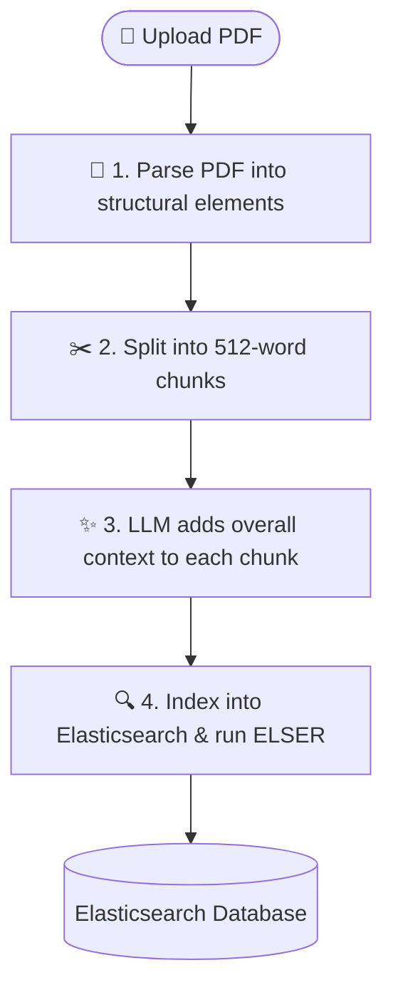
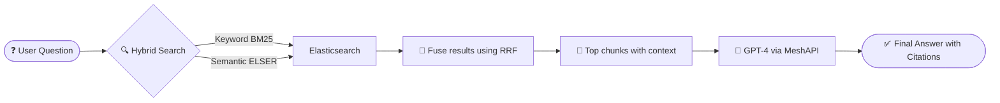
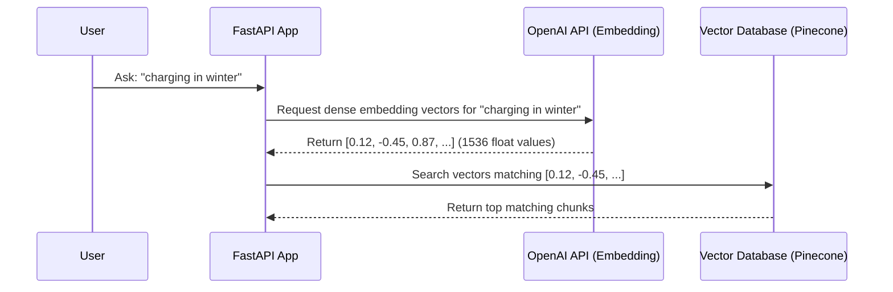
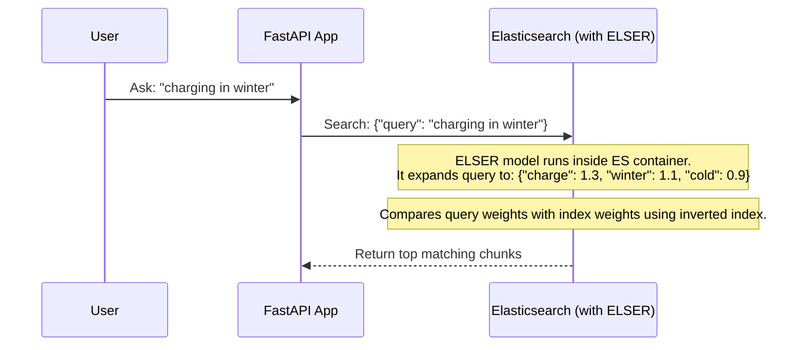
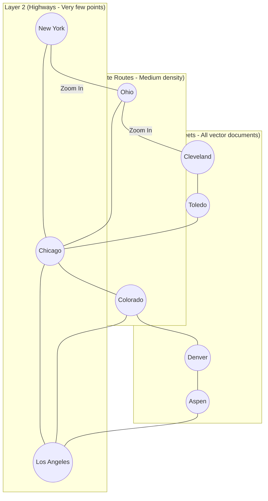

# Beginner's Guide: ELSER-RAG Project Explanation

Welcome to **ELSER-RAG**! This guide is designed to explain this project step-by-step in a simple, easy-to-understand way, even if you are new to AI, vector search, or Retrieval-Augmented Generation (RAG).

---

## 1. Why Does This Project Exist? (The Problem & Solution)

### The Problem: Traditional RAG is Complicated
In a standard RAG system (which lets you ask questions about your documents), developers usually have to build and maintain a complex setup with multiple databases:
1. **A Database for Keyword Search** (like Elasticsearch or Postgres) to find exact matches (e.g., searching for a specific serial number or product name).
2. **A Vector Database** (like Pinecone, Qdrant, or Weaviate) to find conceptual or semantic matches (e.g., understanding that "infant" and "baby" mean similar things).
3. **An Embedding Service** (like OpenAI's API) to convert text into mathematical lists of numbers (dense vectors) before saving them.

This creates **infrastructure overhead**: you have to pay for two databases, keep data synchronized between them, and write complex code to merge their search results.

### The Solution: ELSER-RAG (Simple & Lean)
This project proves that **you do not need a separate vector database or dense embedding API**. 

By using **Elasticsearch** as a single all-in-one search engine with its built-in **ELSER** model, we get:
- Keyword search
- Semantic/conceptual search
- Direct combination of results (hybrid search)
all running inside **one database** with **zero external embedding APIs** needed at search time.

---

## 2. What Does the Project Do?

At a high level, the project does two main things: **Ingesting (Saving) Documents** and **Querying (Asking Questions)**.

### Ingestion Flow (How Documents are Saved)

When you upload a PDF document:
1. **Parse**: We break the PDF down into its components (headings, paragraphs, tables, lists).
2. **Chunk**: We split long documents into smaller parts (chunks) of about 512 tokens (words/sub-words) with a tiny overlap so we don't cut off sentences in the middle.
3. **Enrich**: We use a fast, cost-effective LLM (Large Language Model) via **MeshAPI** to summarize the document and add a short "context prefix" to every chunk. This ensures a chunk about "battery safety" remembers it belongs to the "Electric Vehicle Manual."
4. **Index**: We send these enriched chunks to Elasticsearch. Elasticsearch automatically runs its built-in **ELSER** model to generate semantic weights for the text and stores everything.



---

### Query Flow (How Questions are Answered)

When you ask a question like *"How do I charge the vehicle in cold weather?"*:
1. **Retrieve**: Elasticsearch searches the database using two methods simultaneously:
   - **BM25 (Keyword Search)**: Looks for exact words like "charge," "vehicle," and "cold."
   - **ELSER (Semantic Search)**: Looks for concepts related to charging in winter, even if different words were used (like "low temperatures" or "plugging in during freezing conditions").
2. **Fuse (RRF)**: Elasticsearch merges these two lists of results natively using **Reciprocal Rank Fusion (RRF)** to find the top 20 most relevant chunks.
3. **Generate**: We send your question along with these 20 chunks to a high-quality LLM (like GPT-4).
4. **Respond**: The LLM reads the chunks and writes a natural answer, citing exactly which pages and sections the facts came from.



---

## 3. Why Are We Using These Specific Tools?

Here is the tech stack chosen for the project and why each tool was selected:

| Tool | What it is | Why we use it |
| :--- | :--- | :--- |
| **FastAPI** | Python web framework | It is extremely fast, easy to write, and automatically generates interactive API documentation. |
| **Unstructured** | PDF Parsing Library | Instead of treating a PDF like a giant block of plain text, it recognizes sections, titles, lists, and tables so our chunks are organized. |
| **Tiktoken** | OpenAI token counter | Ensures our text chunks fit exactly within the limits of LLM prompts without getting cut off. |
| **MeshAPI** | Unified LLM Gateway | Gives us a single API key to access different models (GPT, Claude, Gemini). It handles failures automatically and keeps costs low. We use `gpt-5.4-mini` for cheap chunk enrichment and `gpt-5.4` for generating answers. |
| **Docker Compose** | Container orchestrator | Lets you run the entire project (FastAPI app + Elasticsearch + Kibana dashboard) with just one command: `make up-build`. |

---

## 4. What is Elasticsearch and Why is it Used Here?

### What is Elasticsearch?
**Elasticsearch** is a highly popular, open-source search and analytics engine. At its core, it uses an **inverted index** (just like the index at the back of a textbook) to map words to the exact documents containing them. This makes keyword searches incredibly fast.

### Why are we using it in this project?
Instead of using Elasticsearch for text search and a second database for vector search, we use Elasticsearch for **both** because of three powerful features:

#### A. ELSER (Elastic Learned Sparse Encoder)
ELSER is an AI model built directly into Elasticsearch. 
* **Dense Vectors** (used by standard vector databases) convert text into a list of raw, unreadable numbers: `[0.12, -0.34, 0.87, ...]`. You cannot look at these numbers and know what they mean.
* **Sparse Vectors** (generated by ELSER) convert text into a list of concepts/words with weights: `{"charge": 1.2, "battery": 0.95, "power": 0.81}`. 

Because ELSER uses these word-weight pairs, it can store them using the exact same fast **inverted index** structure that Elasticsearch has optimized for decades.

#### B. Native Hybrid Fusion (RRF)
When you combine keyword search and vector search, you get two different kinds of scores (e.g., keyword score is 12.5, vector score is 0.89). Fusing them normally requires writing complex custom math. Elasticsearch has **Reciprocal Rank Fusion (RRF)** built-in, which ranks documents from both methods and combines them cleanly without needing manual score calibration.

#### C. Running the AI model locally inside the DB
With dense embeddings, every time a user types a query, your application has to make a network request to an external API (like OpenAI) to embed the query, then search the DB.
With ELSER, the query is sent directly to Elasticsearch, which does the AI calculation **inside the database** itself. This makes the search faster, more reliable, and completely self-contained.

---

## 5. How ELSER Works (Deep Dive)

### Under the Hood: Sparse Token Expansion
ELSER uses a neural network model to perform **term expansion**. 

Instead of just looking at the exact words in your text, ELSER expands the text into a huge dictionary of related words and weights. The model has been pre-trained on millions of text passages to know which words relate to which concepts.

For example, if your document chunk contains the sentence:
> *"The Model 3 performs exceptionally well in low temperatures."*

ELSER expands this chunk into a sparse representation like:
```json
{
  "model": 1.45,
  "perform": 1.20,
  "temperature": 1.15,
  "cold": 0.98,        // Expanded concept!
  "winter": 0.85,      // Expanded concept!
  "battery": 0.72,     // Expanded concept!
  "freeze": 0.65       // Expanded concept!
}
```

Even though the words **"cold"**, **"winter"**, or **"battery"** were never in the original sentence, ELSER generates them with mathematical weights because it knows they are conceptually linked.

---

### Why Doesn't it Require External Query Embedding?

In traditional Dense RAG (like using Pinecone or Milvus), your application must perform an **external API call** every single time a query is run:



This model requires maintaining API keys, dealing with network lag, paying for embedding tokens on every user search, and handling failures if the embedding API is down.

#### The ELSER Way: Database-Native Inference

In this project, the FastAPI application **never** calls an embedding service at search time. Instead, it sends the plain-text query directly to Elasticsearch:



### Why this is possible:
1. **In-Database Inference**: Elasticsearch downloads the ELSER model (~70MB) directly when it starts. When a query arrives, the model runs on the Elasticsearch hardware/container to perform the term expansion on the query text immediately.
2. **Matching via Inverted Index**: Since both the stored documents and the search query are represented as sparse token-weight lists (dictionaries), Elasticsearch matches them using standard math (dot product of common terms). It doesn't need to do complex, resource-heavy multi-dimensional vector comparisons.
3. **No External Dependency**: Since the model resides inside the database cluster, the retrieval flow is highly reliable, has near-zero network latency, and costs nothing in external API fees.

---

## 6. Understanding Core Concepts: HNSW & Zero-Shot Search

### Concept 1: HNSW (Hierarchical Navigable Small World)
In a traditional vector database (like Pinecone or Qdrant), we represent documents as dense vectors (long lists of decimals like `[0.12, -0.34, 0.87, ...]`). Searching through millions of these vectors one by one would be too slow. To speed this up, vector databases use an index structure called **HNSW**.

#### How HNSW works (The "Highway & Side Streets" Analogy):
Imagine you are driving from New York to a specific house in a small town in California:
1. You don't drive through local neighborhood streets the entire way. 
2. Instead, you get on the **Interstate highway** (high-level layer) to travel cross-country quickly.
3. As you get closer, you exit onto **state routes** (medium layer).
4. Finally, you transition to **neighborhood streets** (bottom layer) to find the exact house.

HNSW builds a multi-layer graph of your vectors exactly like this highway system:



* **The Problem with HNSW in Production**: Because it connects millions of points across multiple virtual layers, this entire graph **must reside in the server's RAM** (Memory) at all times to perform searches quickly. If the graph is loaded from disk, search times grind to a halt. This makes hosting large vector databases extremely expensive.

---

### Concept 2: Zero-Shot Search
In machine learning, **"Zero-Shot"** means a model can successfully perform a task (like searching or classifying) on data it has **never seen before during training**, without needing to be retrained or fine-tuned.

#### Why is Zero-Shot Search useful?
Imagine you train an AI model using only Wikipedia articles. 
* If you then ask it to search through **patent law documents** or **cancer research papers**, it will struggle because legal and medical jargon are completely different from general Wikipedia terms.
* A standard dense embedding model maps these words to incorrect positions in its vector space because it doesn't understand the relationship between the technical jargon.

#### How ELSER solves this for specialized domains:
ELSER is a **sparse encoder** trained on a massive, diverse dataset (MS MARCO) to understand the *relationships* between English words and concepts at a fundamental level. It doesn't memorize definitions; it learns how words behave.

When you feed ELSER a specialized document:
1. **It acts as a conceptual translator**: Even if it has never seen a specific medical document, it recognizes sentence structures and context.
2. **It expands terms conceptually**: If a medical document says *"Patient presents symptoms of cephalalgia,"* ELSER's model knows that *cephalalgia* is conceptually linked to *headache*, *migraine*, and *pain*.
3. **Automatic Mapping**: It automatically expands the index to include those common terms with appropriate weights. 

Thus, when a regular user searches for *"treatments for severe headache"*, the system retrieves the document containing *"cephalalgia"* instantly—even though ELSER was never specifically trained on medical textbooks!

---

## 7. Top 5 Production Use Cases for ELSER

Here are the top 5 concrete production scenarios where ELSER is chosen over dense vector databases:

### 1. 🏢 Enterprise Knowledge Base Search
Companies with internal wikis, Confluence pages, HR policies, and engineering docs already stored in or near Elasticsearch. Employees ask mixed queries — sometimes exact (*"policy AUP-302"*), sometimes conceptual (*"how to expense a client dinner"*). ELSER + BM25 hybrid handles both in one query without deploying a vector database.

### 2. ⚖️ Legal & Compliance Document Discovery
Law firms and compliance teams need to search millions of contracts, emails, and filings. Two critical requirements: **high recall** (don't miss any relevant document) and **explainability** (justify why a document was flagged). ELSER's transparent token weights satisfy both — a lawyer can inspect exactly which expanded terms triggered a match, which is impossible with dense vectors.

### 3. 🎫 Customer Support Ticket Resolution & Routing
Support systems where customers describe problems in everyday language (*"my app keeps crashing when I open photos"*) but the knowledge base uses technical terms (*"memory overflow in image rendering pipeline"*). ELSER bridges this vocabulary gap. Since support platforms often already use the Elastic Stack (ELK) for logging, adding ELSER requires no new infrastructure.

### 4. 📰 Content Platforms & Publishing (News, Blogs, Documentation)
Media companies, documentation sites, and content platforms need "related articles" and semantic search features. The content is general English text (not hyper-specialized), which is exactly what ELSER is trained on. It handles queries like *"articles about climate policy impact on farming"* well, matching documents that use different wording like *"agricultural effects of environmental regulation."*

### 5. 🏛️ Government & Public Sector Document Search
Government agencies manage vast archives of regulations, reports, and public records. They often have strict requirements: **no external API calls** (data sovereignty), **on-premises deployment**, and **limited budgets**. ELSER runs entirely inside the Elasticsearch cluster with no data leaving the network, no per-query API costs, and no third-party dependencies — making it ideal for air-gapped or regulated environments.

---

## 8. Summary: When to Choose ELSER vs. Dense Vector DB

Here is a quick reference framework to help you decide which technology to choose for your project:

| Choose **ELSER** when... | Choose a **Dense Vector DB** (e.g. Pinecone, Qdrant) when... |
| :--- | :--- |
| **You already use Elasticsearch** for logging or search, and want to add semantic capabilities with zero new infrastructure. | **You need multilingual search**. ELSER v2 only supports English. |
| **You need hybrid search** (keywords + semantic context) in one database natively. | **You need the absolute highest semantic accuracy** on an extremely specialized topic (after custom training a dense model). |
| **You need explainable/auditable search results** where you can inspect why a document matched. | **You are comfortable with opaque float arrays** (`[0.12, -0.34, ...]`) and don't need to explain matches. |
| **You have infrastructure constraints** or a tight budget, and cannot host or pay for a separate vector database. | **You have a dedicated vector team** ready to manage and monitor a separate vector database cluster. |
| **Data cannot leave your network** (on-prem/air-gapped), preventing you from calling third-party APIs like OpenAI at search time. | **You are comfortable calling external APIs** (like OpenAI or Cohere) for every single user search query. |

